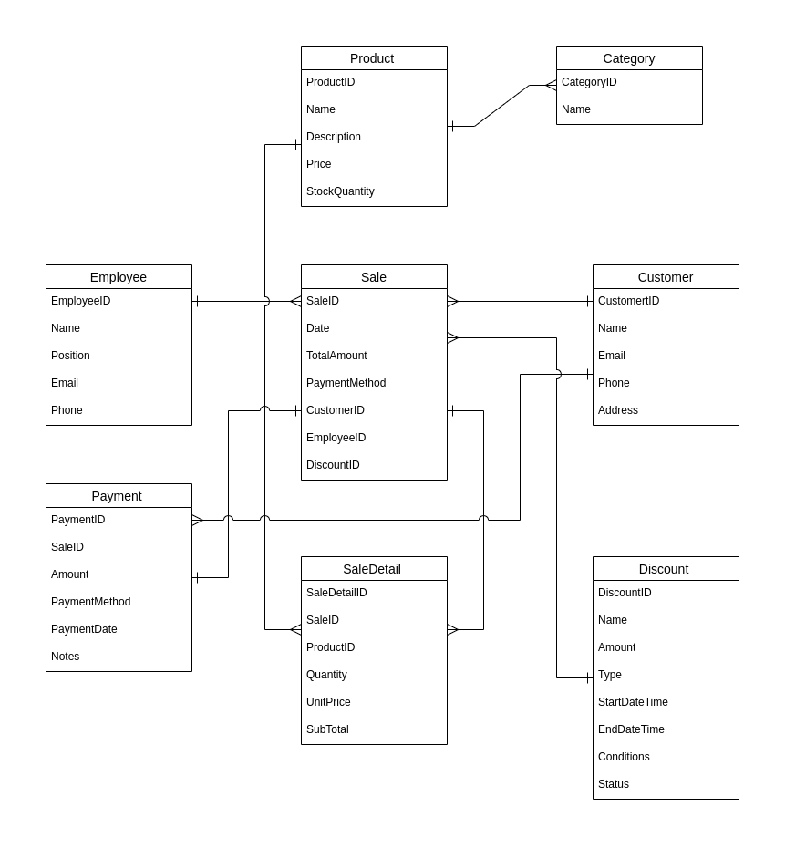

# k6_data_warehouse

1. Buat Conceptual Data Modeling untuk Point of Sales Systems, table table yang terbentuk telah dilakukan normalisasi.

2. Berdasarkan CDM POS yang telah dibuat, implementasikan dalam DBMS.

3. Tentukan table fakta/ FACT Table [SALES atau PRODUCT], berdasarkan CDM POS yang telah anda buat.

4. Untuk membangun datawarehouse lengkapi dengan table Dimensi untuk table fakta yang anda pilih sebelumnya.

5. Bangun sebuah schema STAR atau SNOWFLAKE dan implemntasikan dalam DBMS.

## jawaban

1. [draw.io files](./Conceptual-Data-Modeling.drawio)

2. [CDM-POS-Systems.sql files](./CDM-POS-Systems.sql)

3.  > Berdasarkan conceptual data modeling yang telah dibuat, tabel fakta (FACT table) yang dapat ditentukan adalah tabel **SALES**. Ini karena penjualan (sales) merupakan entitas utama yang mencatat transaksi penjualan yang terjadi di sistem point of sales. 
    
    > Tabel SALES akan mencatat setiap transaksi penjualan yang terjadi, termasuk informasi seperti tanggal penjualan, total jumlah penjualan, metode pembayaran, ID pelanggan, ID karyawan yang melakukan penjualan, dan ID diskon (jika ada). Ini akan menjadi titik sentral dalam menganalisis kinerja penjualan, tren penjualan, dan lainnya dalam sistem point of sales tersebut.> 

4. [CDM-POS-Systems.sql files](./CDM-POS-Systems.sql)
    > UNTUK TABEL DIMENSI

    `Tabel-tabel yang telah disebutkan sebelumnya adalah tabel dimensi untuk mendukung analisis dalam data warehouse. Tabel-tabel tersebut sudah mencakup beberapa dimensi yang umumnya diperlukan dalam analisis data penjualan. Namun, terdapat beberapa aspek tambahan yang dapat menjadi dimensi tambahan tergantung pada kebutuhan bisnis dan kompleksitas sistem:`

    > 1. **Dimensi Waktu**: Dimensi waktu seringkali sangat penting dalam analisis data penjualan untuk melacak tren penjualan seiring waktu. Dimensi waktu dapat mencakup informasi seperti tahun, bulan, tanggal, hari, minggu, jam, dan lainnya.

    > 2. **Dimensi Lokasi**: Jika penjualan dilakukan di berbagai lokasi, maka dimensi lokasi dapat digunakan untuk menganalisis performa penjualan berdasarkan wilayah, kota, negara, atau bahkan alamat spesifik.

    > 3. **Dimensi Kategori Produk**: Meskipun informasi kategori produk sudah disimpan dalam tabel dimensi produk, namun terkadang perlu dimensi terpisah yang lebih terstruktur untuk menganalisis penjualan berdasarkan kategori produk dengan lebih detail.

    > 4. **Dimensi Promosi**: Jika ada program promosi atau kampanye pemasaran yang berjalan, dimensi promosi dapat membantu dalam menganalisis dampak promosi terhadap penjualan.

    > 5. **Dimensi Channel Penjualan**: Jika penjualan dilakukan melalui berbagai saluran atau channel penjualan seperti toko fisik, toko online, dan lainnya, dimensi channel penjualan dapat membantu dalam menganalisis performa penjualan di setiap saluran.

    `Selain itu, terdapat dimensi tambahan lainnya yang dapat ditambahkan sesuai kebutuhan bisnis spesifik. Misalnya, dimensi pelanggan setia, dimensi jenis transaksi (e.g., grosir vs eceran), atau dimensi atribut produk tertentu (e.g., warna, ukuran).`

    `Jadi, sementara tabel-tabel yang telah disebutkan sebelumnya merupakan dimensi umum yang penting, masih ada potensi untuk menambahkan dimensi tambahan tergantung pada kebutuhan analisis bisnis yang spesifik.`

5. [CDM-POS-Systems.sql files](./CDM-POS-Systems-star-schema.sql)