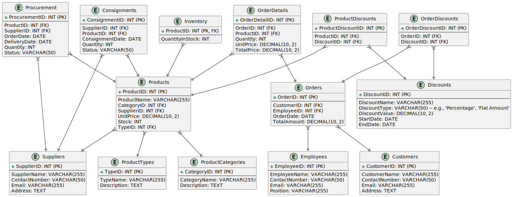

# k6_data_warehouse

1. Buat Conceptual Data Modeling untuk Point of Sales Systems, table table yang terbentuk telah dilakukan normalisasi.

2. Berdasarkan CDM POS yang telah dibuat, implementasikan dalam DBMS.

3. Tentukan table fakta/ FACT Table [SALES atau PRODUCT], berdasarkan CDM POS yang telah anda buat.

4. Untuk membangun datawarehouse lengkapi dengan table Dimensi untuk table fakta yang anda pilih sebelumnya.

5. Bangun sebuah schema STAR atau SNOWFLAKE dan implemntasikan dalam DBMS.

## jawaban

1. [svg files](./tabel.svg)

2. [CDM-POS-Systems.sql files](./CDM-POS-Systems.sql)

3.  > Dalam skema basis data, terutama yang berkaitan dengan sistem Point of Sales dan data warehouse, tabel fakta biasanya adalah tabel yang menyimpan transaksi atau peristiwa penting yang terjadi dalam bisnis. Tabel fakta sering kali berisi pengukuran atau metrik yang dapat diukur, seperti jumlah, total harga, atau kuantitas, dan biasanya memiliki banyak kunci asing yang merujuk ke tabel dimensi.
    
    > Berdasarkan struktur tabel yang telah kita buat, berikut adalah tabel fakta yang relevan:
      1. **Orders / Penjualan**\
            Menyimpan informasi tentang transaksi penjualan, seperti pelanggan, karyawan yang menangani pesanan, tanggal pesanan, dan jumlah total.
      2. **OrderDetails / Detail Penjualan**\
            Menyimpan informasi detail tentang setiap produk yang termasuk dalam pesanan, termasuk kuantitas, harga satuan, dan harga total untuk setiap item.
      3. **Consignments**\
            Menyimpan informasi tentang produk yang dikirim oleh pemasok dengan skema konsinyasi, termasuk tanggal konsinyasi, kuantitas, dan status.
      4. **Procurement**\
            Menyimpan informasi tentang pengadaan produk dari pemasok, termasuk tanggal pemesanan, tanggal pengiriman, kuantitas, dan status.

    > Penjelasan :
      1. **Orders:** Tabel ini merupakan tabel fakta karena mencatat transaksi penjualan yang terjadi, dengan detail siapa yang membeli, siapa yang melayani, kapan transaksi terjadi, dan berapa totalnya.
      
      2. **OrderDetails:** Ini juga merupakan tabel fakta karena mencatat detail dari transaksi penjualan pada tingkat item per item, termasuk jumlah produk yang dibeli dan harga per itemnya.

      3. **Consignments:** Tabel ini adalah tabel fakta karena mencatat pengiriman produk dari pemasok ke toko, termasuk informasi penting seperti kuantitas dan status pengiriman.

      4. **Procurement:** Tabel ini merupakan tabel fakta karena mencatat transaksi pengadaan barang dari pemasok, termasuk kapan pemesanan dan pengiriman terjadi, serta kuantitas yang dipesan.

    > Tabel lainnya seperti Products, ProductCategories, Customers, Suppliers, Employees, Discounts, ProductTypes, ProductDiscounts, dan OrderDiscounts lebih cenderung berperan sebagai tabel dimensi yang mendukung tabel fakta dengan menyediakan konteks dan detail tambahan yang diperlukan untuk analisis lebih lanjut.

4. [CDM-POS-Systems-tabel-dimensi.sql files](./CDM-POS-Systems-tabel-dimensi.sql)
    

5. [CDM-POS-Systems-star-schema.sql files](./CDM-POS-Systems-star-schema.sql)
    > Untuk studi kasus sistem Point of Sales (POS) seperti yang Anda jelaskan, Star Schema biasanya lebih cocok. Berikut beberapa alasan mengapa Star Schema lebih cocok:

    1. **Sederhana dan Mudah Dipahami**\
        Struktur: Star Schema memiliki struktur yang lebih sederhana dengan tabel fakta di pusat dan tabel dimensi yang mengelilinginya. Ini membuatnya lebih mudah dipahami dan diimplementasikan.
        Query: Menulis query dalam Star Schema biasanya lebih sederhana dan cepat karena tabel dimensi langsung berhubungan dengan tabel fakta.
    2. **Kinerja**\
        Performansi: Untuk operasi analisis OLAP (Online Analytical Processing), Star Schema umumnya memberikan performa yang lebih baik karena join yang lebih sedikit antara tabel dibandingkan dengan Snowflake Schema.
        Indeks: Indeks pada tabel fakta dan tabel dimensi dalam Star Schema dapat meningkatkan performa query.
    3. **Redundansi dan Desain yang Tidak Terlalu Terfragmentasi**\
        Redundansi yang Dapat Diterima: Meskipun ada beberapa redundansi data dalam tabel dimensi, ini umumnya dapat diterima karena memberikan kinerja yang lebih baik dan membuat desain database lebih mudah dipahami.
        Desain yang Tidak Terlalu Terfragmentasi: Star Schema menghindari fragmentasi yang berlebihan dari data, yang sering terjadi pada Snowflake Schema akibat normalisasi lebih lanjut.
    4. **Fokus pada Analisis dan Pelaporan**\
        Analisis: Star Schema cocok untuk analisis data dan pelaporan, karena sebagian besar query analitik memerlukan akses cepat ke dimensi dan fakta.
        Pengguna Bisnis: Pengguna bisnis yang tidak memiliki latar belakang teknis yang kuat akan menemukan Star Schema lebih intuitif untuk eksplorasi dan pelaporan data.
